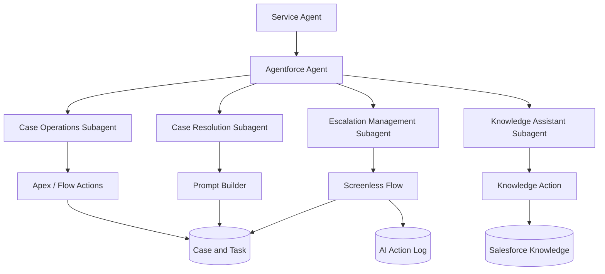

# AgentOps AI — Enterprise Service Operations Copilot

An Agentforce-powered service operations copilot that helps support teams retrieve case context, generate grounded case summaries, answer knowledge questions, and complete governed case-management actions through natural-language conversation.

> **Portfolio project:** Demonstrates practical Agentforce implementation across Agentforce Builder, Prompt Builder, Flow, Apex, Service Cloud, Knowledge, and Lightning Web Components.

## Business problem

Service agents lose time moving between customer cases, activity history, Knowledge articles, and repetitive case-management tasks. Important escalation work is also inconsistent and difficult to audit.

AgentOps AI provides a conversational assistant inside Salesforce that retrieves trustworthy context, proposes the next action, and automates approved operational tasks while retaining an audit trail.

## MVP capabilities

- **Open-case intelligence** — retrieve and prioritize a user's open P1/P2 cases.
- **Case resolution summary** — produce a concise summary of the issue, timeline, customer context, likely next action, and outstanding risks.
- **Knowledge assistance** — answer support questions using approved Salesforce Knowledge content and return the supporting article.
- **Governed escalation** — validate an escalation request, present the intended changes, request confirmation, and then update the case through Flow.
- **Follow-up task creation** — create a task with a clear owner, due date, and context.
- **Action auditability** — record every agent-initiated write action, status, and outcome in an action log.

## Architecture

## Agent design

| Subagent | Responsibility | Core actions |
| --- | --- | --- |
| Case Operations | Find and prioritize active work | Get open cases, retrieve case details |
| Case Resolution | Explain a case and guide resolution | Build case context, generate summary |
| Escalation Management | Execute controlled updates | Validate escalation, confirm, escalate, create follow-up task |
| Knowledge Assistant | Provide grounded help | Answer questions using approved Knowledge articles |

## Guardrails

- The copilot treats case and Knowledge data as the source of truth; it does not invent facts.
- Read actions can run immediately; record-changing actions require explicit confirmation.
- Escalations use deterministic Flow validation for priority, ownership, and routing.
- Each write action is logged to `AI_Action_Log__c` for traceability.
- The agent surfaces uncertainty and hands work back to a human when it cannot verify an answer.

## Data model

### Standard objects

- `Case`
- `Task`
- `Knowledge`

### Custom object

`AI_Action_Log__c` records agent-initiated changes.

| Field | Purpose |
| --- | --- |
| `Conversation_Id__c` | Links actions from the same conversation |
| `Case__c` | Related service case |
| `Action_Name__c` | Executed agent action |
| `Status__c` | Success, failed, or awaiting confirmation |
| `Input_Summary__c` | Safe summary of the requested action |
| `Result_Summary__c` | Outcome returned to the user |
| `Executed_By__c` | Salesforce user who initiated the action |
| `Executed_At__c` | Timestamp of execution |

## Technology stack

- Salesforce Agentforce and Agentforce Builder
- Prompt Builder
- Service Cloud and Salesforce Knowledge
- Salesforce Flow
- Apex and invocable Apex actions
- Lightning Web Components (LWC)
- SOQL and Salesforce security model
- Salesforce DX and source-driven development

## Delivery roadmap

| Sprint | Outcome |
| --- | --- |
| 0 — Foundation | Project setup, architecture, Developer Org configuration, documentation |
| 1 — Service data | Case configuration, sample data, Knowledge articles, action log object |
| 2 — Agentforce | Agent, subagents, instructions, Prompt Builder template |
| 3 — Actions | Case retrieval, summary, knowledge, escalation, and task actions |
| 4 — Experience | LWC dashboard and action history |
| 5 — Portfolio | Tests, screenshots, demo script/video, and resume-ready outcomes |

## Local setup

1. Create or authorize a Salesforce Developer Org with the required Agentforce and Service features available.
2. Create a Salesforce DX project in this folder.
3. Set the Developer Org as the default org.
4. Deploy project metadata once source components are added.

> Availability of Agentforce, Prompt Builder, and Knowledge depends on the Developer Org's enabled features and entitlements. This project documents and uses only the features available in the target org.

## Success criteria

The MVP is complete when a service agent can use natural language to retrieve open cases, receive a grounded case summary, find an approved Knowledge answer, create a follow-up task, and escalate a case with confirmation and an auditable result.

## Author

Built as a Salesforce Agentforce portfolio project focused on enterprise service operations, governed automation, and application-architecture practices.
